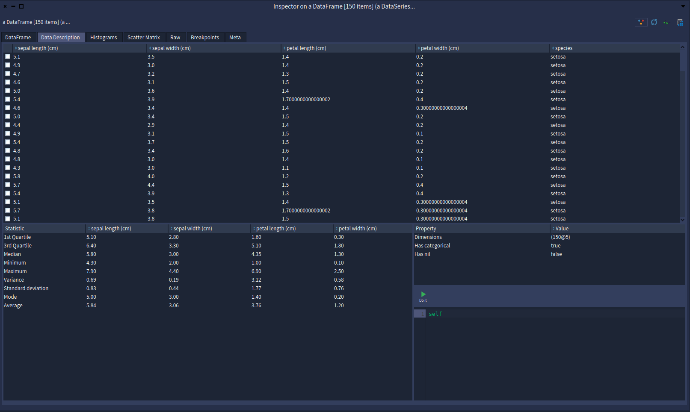
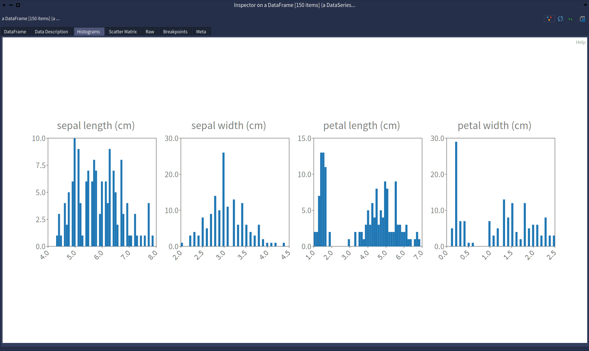
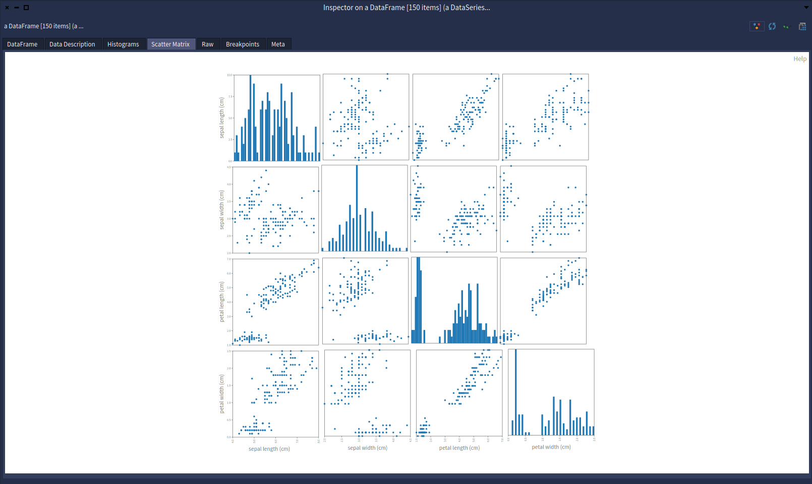

[](https://github.com/pharo-ai/data-inspector/actions/workflows/CI.yml)
[](https://coveralls.io/github/pharo-ai/data-inspector?branch=master)
[](https://pharo.org/download)
[](https://pharo.org/download)
[](https://raw.githubusercontent.com/pharo-ai/data-inspector/master/LICENSE)

# Description

A Pharo inspector extension to operate and view DataFrame multiple information in a same inspector view. Currently it displays:
- General informations about the dataframe
- Histograms about all numerical columns of the dataframe
- A scatter matrix of the DataFrame

A configurable limit is set by default to quickly visualize a DataFrame when we are in the inspector. To change the limit, for example to 50000, you can evaluate:

```smalltalk
AISpDataFrameInspector maxRows: 50000
```

# Installation

```smalltalk
Metacello new
	baseline: 'AIDataFrameInspector';
	repository: 'github://pharo-ai/data-inspector/src';
	onConflictUseIncoming;
	load
```

# If you want to depend on it

```smalltalk
spec 
   baseline: 'AIDataInspector' 
   with: [ spec repository: 'github://pharo-ai/data-inspector/src' ].
```

# Usage

Just inspect any DataFrame and select the palette with "Data Inspector":

```smalltalk
EpMonitor disableDuring: [ 
	Metacello new
		baseline: 'AIDatasets';
		repository: 'github://pharo-ai/datasets';
		load ].

AIDatasets loadIris inspect.
```







It is also possible to visualize the historigrams of a DataFrame or a DataSeries like this

```st
iris := AIDatasets loadIris.

iris histograms.
(iris column: #'petal length (cm)') histogram.
```

You can specify the number of intervals to display like this:

```st
iris histogramsBins: 50.
(iris column: #'petal length (cm)') histogramBins: 50.
```

The scatter matrix can be opened like this:

```st
iris scatterMatrix
```
